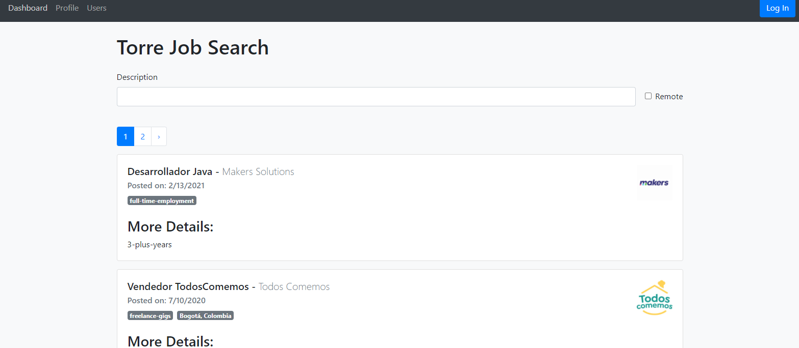

# Project: Building a Job Search App

This is a project of building a Job Search App, where a user can search for remote jobs. Data of different jobs is pulled from Torre Labs API and displayed in the app for different people to search.

 

## Built With

- ReactJS
- Torre API
- Bootstrap
- Auth0

## Live link

<a href="https://my-job-search-app.herokuapp.com/">Live Version</a>

## Getting Started

Open your terminal or text editor and use next command

        git clone https://github.com/emmanuelkamala/jobs-app.git

        cd jobs-app

        Run 'yarn install' command to install package dependencies.

## Run the app

### Open terminal

yarn start

### On the browser:

visit: http://localhost:3000

## Author

👤 **Author1**

- Github: [emmanuelkamala](https://github.com/emmanuelkamala)
- Twitter: [ejkamala](https://twitter.com/ejkamala)
- Linkedin: [emmanuelkamala](https://linkedin.com/in/emmanuelkamala)

## 🤝 Contributing

Contributions, issues and feature requests are welcome!

Feel free to check the [issues page](issues/).

## Show your support

Give a ⭐️ if you like this project!
